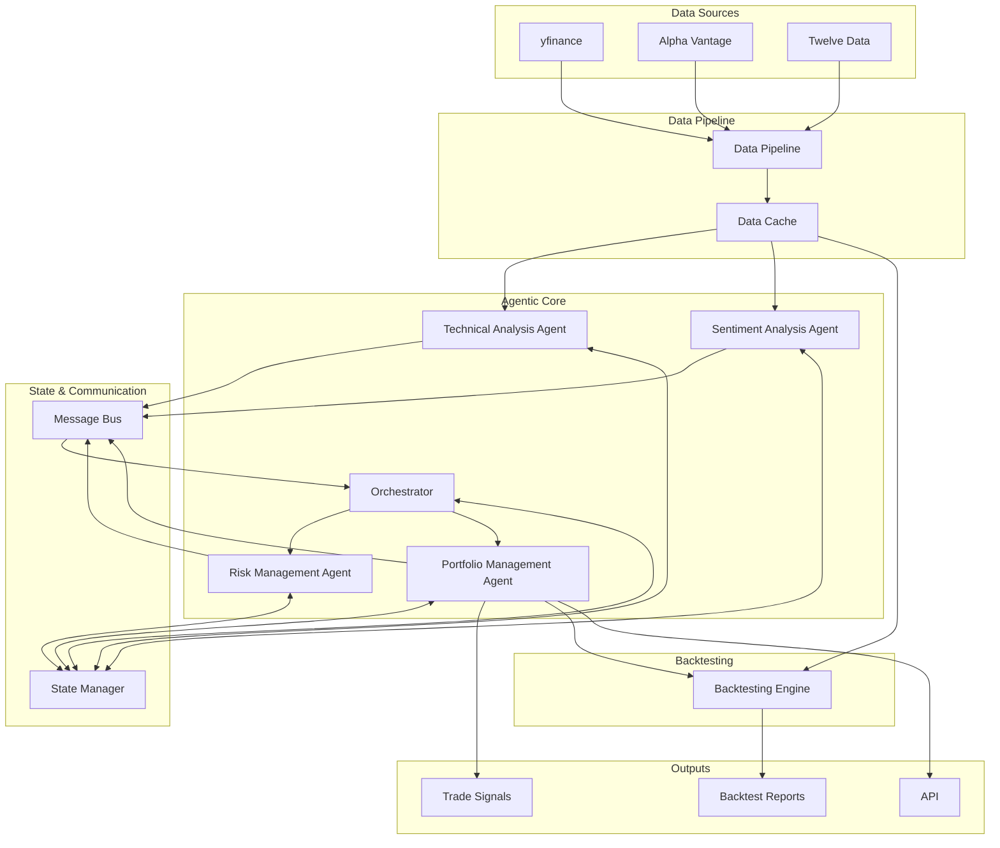

# System Architecture

This document outlines the architecture of the AI Trading System. The system is designed as a multi-agent ecosystem that collaborates to analyze financial markets, generate trading signals, and manage a portfolio.

## 1. High-Level Overview

The system follows a modular, service-oriented architecture. At its core is a set of specialized AI agents, each responsible for a specific domain of analysis. These agents communicate and share state through a central message bus and state manager. A data pipeline feeds real-time and historical market data into the system, and a backtesting engine allows for strategy evaluation.

## 2. Agent Architecture

The system is composed of several specialist agents, each an independent component with a defined responsibility. This design allows for modularity, scalability, and ease of maintenance.

### 2.1 Base Agent

All agents inherit from a `BaseAgent` class that defines a common interface. This includes:
-   Configuration (`AgentConfig`)
-   An `analyze` method to process market data.
-   A standard output format (`AgentDecision`).
-   Integration with the system's LLM client, message bus, and state manager.

### 2.2 Core Agents

-   **Technical Analysis Agent**: Analyzes quantitative market data, including price action, chart patterns, and technical indicators (e.g., RSI, MACD, Bollinger Bands).
-   **Sentiment Analysis Agent**: Gauges market sentiment by processing qualitative data from news headlines, social media, and financial news articles.
-   **Risk Management Agent**: Assesses risk for proposed trades and the portfolio as a whole. It calculates metrics like Value at Risk (VaR) and position sizing to ensure alignment with the portfolio's risk tolerance.
-   **Portfolio Management Agent**: The final decision-maker. It synthesizes the analyses and recommendations from all other agents, considers the overall portfolio state, and makes the final call on whether to execute a trade.

## 3. Agent Communication & State Management

Agents operate in a coordinated manner, sharing information and state through a central communication system.

### 3.1 Message Bus

A **Message Bus** facilitates asynchronous communication between agents using a Publisher/Subscriber pattern. When an agent completes an analysis, it publishes its `AgentDecision` to a specific topic on the bus. Other agents or the orchestrator can subscribe to these topics to trigger their own processes. This decouples the agents from each other.

### 3.2 Shared State Management

A **State Manager**, backed by a Redis instance, maintains the shared state of the system. This includes:
-   Current market data.
-   The state of the portfolio (e.g., open positions, cash balance).
-   Agent decisions and analyses.
Using a centralized, persistent state store ensures data consistency and allows the system to be resilient and scalable.

### 3.3 Orchestration

An **Orchestrator** is responsible for managing the overall workflow of the agentic system. It directs the sequence of agent activation, ensuring that data flows logically through the analysis pipeline. The orchestrator can implement various patterns:
-   **Sequential**: A simple, linear workflow where agents are activated one after another.
-   **Parallel**: Technical and Sentiment agents run in parallel to speed up analysis.
-   **Hierarchical**: The Portfolio Manager acts as a supervisor, requesting analyses from other agents as needed.

We will be using **LangGraph** to implement this stateful, multi-agent orchestration, which provides a robust framework for building and managing these complex workflows.

## 4. Data Pipeline

The data pipeline is responsible for ingesting, processing, and caching all market data required by the agents.

-   **Providers**: It interfaces with multiple external data sources (Alpha Vantage, Twelve Data, yfinance) through a standardized provider interface that handles rate limiting and failover.
-   **Processing**: The pipeline calculates a suite of technical indicators and normalizes data from different sources into a standard `MarketData` format.
-   **Caching**: A multi-level caching strategy (In-memory, Redis) is used to minimize redundant API calls and ensure fast data access for the agents.

## 5. Backtesting Engine

The backtesting engine allows for evaluating the performance of the trading strategy against historical data. It simulates trade execution, accounting for factors like commissions and slippage. The engine will use a library like `backtrader` or `vectorbt` and will be fed by simplified, deterministic models of the agents to ensure that backtests are fast and repeatable.

## 6. Deployment & Infrastructure

The entire system is designed to be containerized using Docker for portability and scalability. A `docker-compose` setup will orchestrate the different services:
-   The main AI trading system application.
-   A Redis container for caching and state management.
-   A PostgreSQL container for persistent data storage (e.g., trade history, backtest results).
